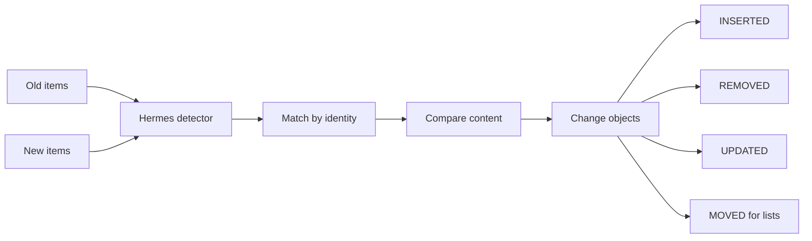

# Hermes

🪽 A Java 17 library to detect changes between collection items.

Hermes compares two versions of a collection and reports explicit changes: inserted, removed, updated, and, for ordered lists, moved items.
It is useful when an application receives refreshed data and needs to synchronize a UI, update a cache, publish audit events, or send compact change notifications instead of replacing a whole collection.

Hermes is the Greek god of commerce, travelers, communication, and the exchange of information.
The name reflects the library's purpose: carrying precise information about what changed between two sets of data.

[](https://github.com/albertoirurueta/hermes/actions/workflows/main.yml)
[](https://github.com/albertoirurueta/hermes/actions/workflows/develop.yml)

[](https://sonarcloud.io/dashboard?id=albertoirurueta_hermes)
[](https://sonarcloud.io/dashboard?id=albertoirurueta_hermes)
[](https://sonarcloud.io/dashboard?id=albertoirurueta_hermes)
[](https://sonarcloud.io/dashboard?id=albertoirurueta_hermes)
[](https://sonarcloud.io/dashboard?id=albertoirurueta_hermes)
[](https://sonarcloud.io/dashboard?id=albertoirurueta_hermes)
[](https://sonarcloud.io/dashboard?id=albertoirurueta_hermes)
[](https://sonarcloud.io/dashboard?id=albertoirurueta_hermes)
[](https://sonarcloud.io/dashboard?id=albertoirurueta_hermes)
[](https://sonarcloud.io/dashboard?id=albertoirurueta_hermes)
[](https://sonarcloud.io/dashboard?id=albertoirurueta_hermes)

## Project Status

| Area | Status |
| --- | --- |
| Language | Java 17 |
| Build tool | Maven |
| Current development version | `1.3.0-SNAPSHOT` |
| Latest release shown here | `1.2.0` |
| License | Apache License 2.0 |
| CI | GitHub Actions for release and `develop` branch builds |
| Quality | SonarCloud, JaCoCo, Surefire, Javadoc, Checkstyle, SpotBugs, PMD |

## Documentation

- 📘 [Antora documentation](http://albertoirurueta.github.io/hermes)
- 🧾 [Maven site report](http://albertoirurueta.github.io/hermes/mvn-site)
- 🔍 [SonarCloud dashboard](https://sonarcloud.io/project/overview?id=albertoirurueta_hermes)
- 📝 [Changelog](CHANGELOG.md)

## Installation

Latest release:

```xml
<dependency>
    <groupId>com.irurueta</groupId>
    <artifactId>hermes</artifactId>
    <version>1.3.0</version>
    <scope>compile</scope>
</dependency>
```

Latest snapshot:

```xml
<dependency>
    <groupId>com.irurueta</groupId>
    <artifactId>hermes</artifactId>
    <version>1.4.0-SNAPSHOT</version>
    <scope>compile</scope>
</dependency>
```

## How It Works

Hermes separates item identity from item content:

- **Identity** decides whether two objects represent the same logical item, for example two records with the same id.
- **Content equality** decides whether that logical item has changed.



## Choosing a Detector

Pick a detector based on whether order matters, whether your item implements `ComparableItem`, and whether list positions should be interpreted as snapshot positions or sequential edit positions.

| Use case | Detector |
| --- | --- |
| Position-independent collections with custom comparators | `CollectionItemChangeDetector` |
| Position-independent collections with `ComparableItem` items | `ComparableCollectionItemChangeDetector` |
| Lists with custom comparators and snapshot positions | `ListItemChangeDetector` |
| Lists with `ComparableItem` items and snapshot positions | `ComparableListItemChangeDetector` |
| Lists with custom comparators and sequential edit positions | `SequentialListItemChangeDetector` |
| Lists with `ComparableItem` items and sequential edit positions | `ComparableSequentialListItemChangeDetector` |

## Quick Example

```java
import com.irurueta.hermes.ListItemChangeDetector;

import java.util.List;
import java.util.Objects;

record Item(int id, String content) { }

var detector = new ListItemChangeDetector<Item>(
        (item1, item2) -> item1.id() == item2.id(),
        (item1, item2) -> Objects.equals(item1.content(), item2.content()));

var oldList = List.of(
        new Item(1, "item1"),
        new Item(2, "item2"),
        new Item(3, "item3"),
        new Item(4, "item4"));

var newList = List.of(
        new Item(3, "item3"),
        new Item(2, "item2b"),
        new Item(1, "item1"),
        new Item(5, "item5"));

var changes = detector.detectChanges(newList, oldList);
```

The previous example reports:

| Action | Meaning |
| --- | --- |
| `REMOVED` | Item 4 was removed from position 3. |
| `INSERTED` | Item 5 was inserted at position 3. |
| `MOVED` | Item 1 moved from position 0 to position 2. |
| `MOVED` | Item 3 moved from position 2 to position 0. |
| `UPDATED` | Item 2 kept the same identity but changed content. |

## Developer Setup

### Requirements

- JDK 17
- Maven
- Node.js 24 or newer, only needed to build the Antora documentation locally

### Build and Test

```bash
mvn clean test
```

Run the full local Maven verification, including package generation and reports:

```bash
mvn clean jacoco:prepare-agent install jacoco:report javadoc:jar source:jar -P '!build-extras'
mvn site -Djacoco.skip -DskipTests -P '!build-extras'
```

The Maven site is generated in:

```text
target/site
```

Useful generated reports:

| Report | Local path |
| --- | --- |
| Javadoc | `target/site/apidocs/index.html` |
| JaCoCo | `target/site/jacoco/index.html` |
| Surefire | `target/site/surefire-report.html` |

### Build Documentation

The Antora project lives under `docs`.
Install the documentation dependencies once:

```bash
cd docs
npm install
```

Generate the documentation site:

```bash
cd docs
npx antora antora-playbook.yml
```

The Antora site is generated in:

```text
docs/build/site
```

The published GitHub Pages site combines the Antora output with Maven reports under `mvn-site`.

## Repository Layout

```text
src/main/java/com/irurueta/hermes   Library source
src/test/java/com/irurueta/hermes   Unit tests
docs                                Antora documentation
docs/modules/ROOT/pages             Documentation pages
target/site                         Maven site output
```

## Quality and Release Notes

- ✅ Unit tests are executed with Maven Surefire.
- 📈 Coverage is generated with JaCoCo and reported to SonarCloud.
- 🧪 Static analysis includes SonarCloud, Checkstyle, SpotBugs, and PMD reports.
- 📚 Javadoc and source jars are attached by the Maven build extras profile.
- 🚀 Release workflow deploys signed artifacts to Maven Central when a GitHub release is published.
- 🌿 The `develop` workflow builds tests, reports, Antora documentation, and publishes the combined documentation site.

## License

Hermes is available under the [Apache License 2.0](LICENSE).
